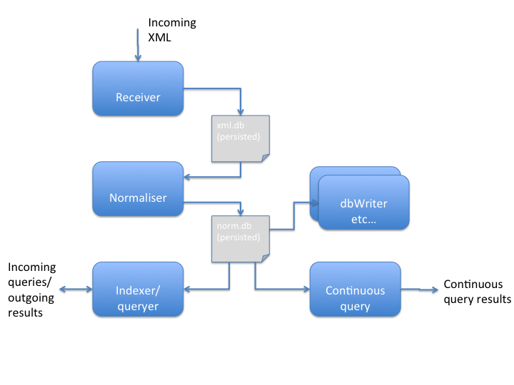

## How fast?
Below I describe an XML processing pipeline that can:

* Ingest __and persist to disk__ XML at the rate of 150MB/sec, while simultaneously
* Normalising each incoming XML (extract values from the XML, 50 tags configured as xpaths) and __persist results to disk__, while simultaneously
* Building an index over all normalised values and absorbing thousands of queries executed against indexed data

The test scenario described below (see throughput test in [README2](README2.md)) simulates the ingestion of 1M XML messages of average size 29K, normalisation of them,
indexing of them and executing queries against the index continuously. The test runs in 10 minutes, converting 29G of XML
into 1.1GB of normalised data and an index of size 500MB, while concurrently executing 2000 queries returning 1.2GB of data.

Above scenario focuses on throughput but this pipeline also exhibits very impressive latency numbers - with messages moving between components typically < 20ns.

## How does it work?
### Design Principles

* Fast & efficient
    * Able to absorb significant load on a single box - no hadoop etc. cluster required
* Mechanical sympathy
    * Cache oblivious, streaming architecture
    * Minimise pointer chasing - XML and Java objects backed by byte array
    * No thread synchronisation - components are single threaded, although quite possible to use a thread pool for CPU-intensive tasks
    * Efficient usage of disk - as little random access as possible
    * Use the OS features - make use of its VM subsystem to transparently map files to memory and vice versa
* Pipeline architecture
    * Each component acts like a unix utility - accepting input from a Chronicle, and writing output to a Chronicle 
    * Persist to disk so processing can restart in case of component failure
* Minimise GC
    * Most components don't generate garbage in their core processing, if they do it is only when they call out to 3rd party libraries 
    * Because of low amount of garbage created, GC pauses are short and heap usage low 
* Careful choice of libraries and implementation for performance e.g. index implemented with Trove collections to reduce memory use, GC, and pointer chasing 

### Implementation
* Peter Lawrey's fantastic [Chronicle-Queue](https://github.com/OpenHFT/Chronicle-Queue)
* [Trove collections](http://trove.starlight-systems.com/)

