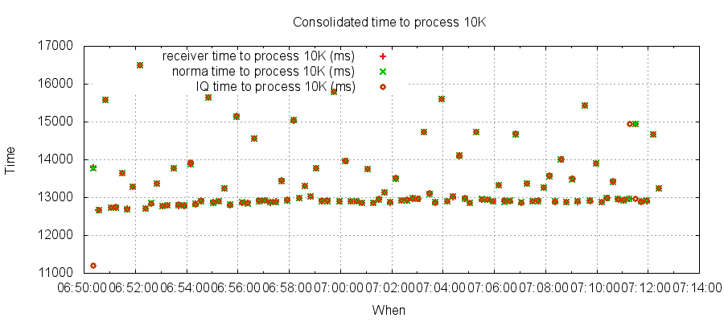
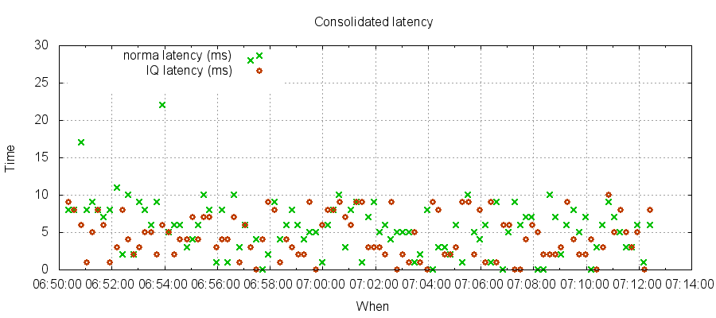

## Solution
### Components
#### Receiver
Receives XML, assigns an ID, and persists to disk together with received timestamp. Core processing does not generate any garbage and streams XML
straight out to disk. Very low latency and very high throughput.
This job of this component is to "land" incoming XML to disk and make it available for downstream processing pipelines.
#### Normaliser
Tails persisted XML file, loads XML, extracts configured subset of individual tag values from the XML, and persists to disk in normalised file. Three versions have been implemented:

* JAXB implementation converts the XML to a Java object in memory - this takes the most up-front time but is suitable for very complex and very numerous extractions of tags from XML
* XOM implementation uses [XOM](www.xom.nu) to execute configured xpaths against XML
* Custom implementation that makes use of a low latency XML parser and cut-down support for an xpath subset. Low garbage and considerably lower latency and higher throughout than JAXB and XOM impls. This is used for benchmark figures quoted on this page.

#### Indexer
Tails normalised file and builds an in-memory index of every normalised value.
#### Queryer
Allows basic queries to be executed suchs as:

* load xml or normalised data by ID
* find xml or normalised data by indexed values

#### ContinuousQuery
Continuous queries e.g. count of received messages in last 10 seconds, alert where a trade's attributes have changed
#### DBWriter
Not implemented yet. Will build on JAXB indexer and write XML to relational tables.
#### Downstream analytics
Not implemented yet.

### Performance
Test harness uses approx 110 example FpMLs from FpML website, some of which have been increased in size, and values substituted values e.g. tradeId, tradeDate etc. Average size of each XML file is approx 29K. 

* Test scenario is to send 1M FpML files, with a total size of approx 29GB. These XMLs are generated using the test harness and passed to Receiver. All components are run simultaneously
* Normaliser tails received XML file and normalises using custom implementation before writing to normalised file
* Indexer tails normalised file and builds in-memory index
* During the test run the Queryer is run to repeatedly execute the same queries: 
    * get all of a particular type 
    * get all on tradeDate of X 
    * get normalised data by random ID 
    * get xml by random ID 
    * get count.

#### Throughput test
To test what happens when you throw as much XML in the front only constrained by write speed to disk.
Not entirely realistic as super-fast no garbage XML generation component actually embedded in receiver for maximum speed.

* EC2 c3.xlarge
    * Total test execution time 550 seconds
        * Receiver completed in 200 seconds, persisting 1M messages at 5K msgs/sec, each message average #chars 28,858 (148 MB/sec)
        * Normaliser completed in 550 seconds, reading, normalising and persisting 1M messages at 1,800 msgs/sec
        * Indexer completes processing in 550 seconds, reading and indexing 1M messages
        * Queryer executes during entire test run, executing approx 2,000 queries, returning a total of 1.25G of data, (1.4M rows - average 700 rows per query), in an average of 220 ms per query
* MacBook Pro 4 cores and SSD:
    * Total test execution time 1013 seconds
        * Receiver completed in 432 seconds, persisting 1M messages at 2,300 msgs/sec, each message average #chars 28,858
        * Normaliser completed in 865 seconds, reading, normalising and persisting 1M messages at 1,100 msgs/sec
        * Indexer completes processing in 1013 seconds, reading and indexing 1M messages
        * Queryer executes during entire test run, executing approx 1,800 queries, returning a total of 672,000 rows (average 366 rows per query), in an average of 515 ms per query
* MacBook Pro 4 cores and HDD:
    * Total time 2484 seconds 
        * Receiver completed in 1561 seconds
        * Normaliser completed in 2464 seconds
        * Indexer completed in 2484 seconds
        * Approx 2180 queries, total of 1,634,000 rows, 749 average, avg 1,100 ms per query (because the test takes longer, more queries executed!)

#### Latency test
Generate XML at a slower rate than throughput test (750 msgs/sec which is about 20MB/sec) so as to reduce load on system and ensure 
that all components can keep up. 

* EC2 c3.xlarge
    * Total test execution time 1350 seconds
        * Receiver completed in 1340 seconds, persisting 1M messages at 750 msgs/sec, each message average #chars 28,858 (20 MB/sec)
        * Normaliser completed in same time, reading, normalising and persisting 1M messages at same rate as receiver
            * Average latency from msg written by receiver, to normaliser reading it and normalising it is 6ms, with 99% under 22ms
        * Indexer completes processing in same time, at same rate as receiver
            * Average latency from msg written by normaliser to indexer indexing it is 5ms, with 99% under 9ms
        * Queryer executes during entire test run, executing approx 4,100 queries, returning a total of 3.4G of data, (4M rows - average 970 rows per query), in an average of 260 ms per query

##### Throughput
See below throughput for each of receiver, normaliser, indexer. Each point is 10K messages.

##### Latency
See below

